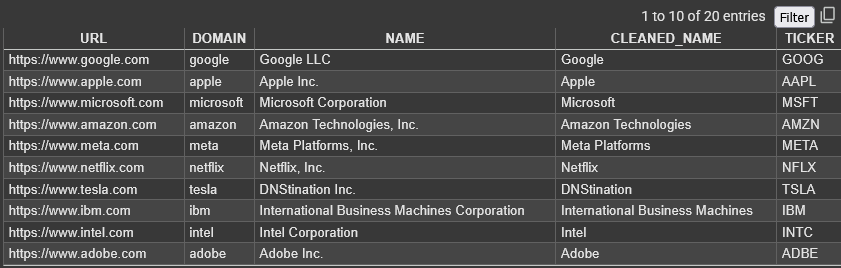

# extrct
Python script takes a list of company/organization URLs and extracts:

- The **company name** (using WHOIS or fallback guessing)
- The corresponding **stock ticker symbol** (from Yahoo Finance API)

So. I was thinking to use webscrapping along with yfinance, for better and accurate outputs. Thats one of the way to also approach the problem. Why i didnt approach it? seems like this way was sort of an essay escape, but in future will alsp upload a file with webscrapping technique or the one with APIs (especially the api from linkdin for better name search).
In this one in particular i have tried to guess the name of the orgs or companies if Im not able to find them on Whois. 

# Output


# How it works?
    DOMAIN Extraction  - Extracts the core domain name from the URL using tldextract.

    WHOIS Lookup       - Attempts to fetch the company’s registered name using the whois library.
                          If WHOIS fails or is privacy-protected, it falls back to guessing.

    Fallback Company Name Guessing - 
    Dynamically generates possible company names like:

    ``` Nvidia → [Nvidia, Nvidia Inc., Nvidia Corporation, Nvidia Technologies, ...] ```
    
    Ticker Lookup via Yahoo Finance API - 
    Searches each guessed name using Yahoo Finance’s open search API. Returns the first valid EQUITY ticker symbol.

    Rate Limiting       - time.sleep(1) between each request to avoid being rate-limited.

# Install dependancies 
``` pip install pandas tldextract python-whois requests ```


